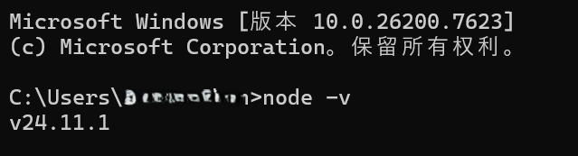
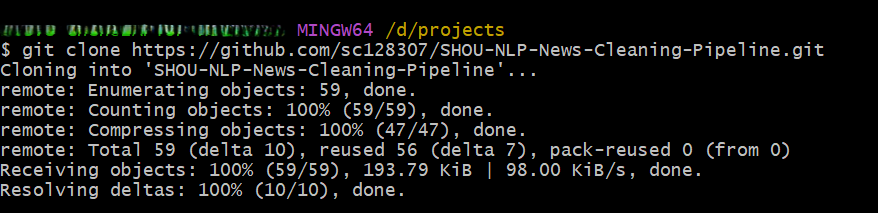
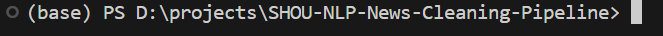

# 🧹 NLP Intelligent Corpus Cleaning Tool

### (NLP 智能语料清洗工具 - Electron 版)

这是一个专为**新闻语料处理**设计的现代化桌面工具。它结合了 **React** 和 **Python**，能够自动将格式混乱的 RTF 新闻文档清洗为结构化的数据。

---

## ✨ 核心功能

* **⚡ 硬件加速**：自动识别你的电脑硬件。
* **NVIDIA 显卡**：开启 CUDA 加速。
* **Mac M1/M2/M3**：开启 Metal (MPS) 加速。
* **普通电脑**：自动切换 CPU 模式，保证能跑。


* **🧠 AI 智能去噪**：内置 DeBERTa AI 模型，自动识别并删除广告、无关链接和图片说明等噪音。
* **📂 批量处理**：一键处理成百上千个文件。
* **📊 可视化**：实时进度条、硬件状态监控、Excel 报表生成。

---


## 🛠️ 第一阶段：安装基础软件

在下载代码之前，请先检查你的电脑是否安装了以下 4 个软件。如果没有，请务必按照链接下载并安装。

### 1. 安装 VS Code (代码编辑器)

这是我们要用到的操作平台，比黑乎乎的命令行更好用。

* **下载地址**: [VS Code 官网](https://code.visualstudio.com/)
* **安装步骤**: 点击 "Download for Windows"，下载后一路点击 "Next" 安装即可。
* **(可选)**: 安装中文插件（搜索 Chinese 安装）会让界面变成中文。

### 2. 安装 Git (代码下载工具)

我们需要用它把项目从网上拉取到你的本地电脑。

* **下载地址**: [Git 官网](https://git-scm.com/download/win)
* **安装步骤**: 选择 "64-bit Git for Windows Setup"。
* **注意**: 安装过程中会出现很多选项，**全部保持默认，一路点击 Next 到底**即可。

### 3. 安装 Node.js (用于运行界面)

* **下载地址**: [Node.js 官网](https://nodejs.org/en)
* **版本选择**: 请务必下载左边的 **LTS (长期支持版)**，不要下载 Current 版。
* **验证安装**:
1. 按键盘 `Win + R`，输入 `cmd`，回车。
2. 在黑框里输入 `node -v`。
3. 如果出现 `v18.xx.x` 或 `v20.xx.x`，说明安装成功。




### 4. 安装 Miniconda (用于管理 Python 环境)

为了防止 Python 版本冲突，我们需要用 Conda 创建一个独立的环境。

* **下载地址**: [Miniconda 官网](https://www.anaconda.com/download/success)
* **下载文件**: 找到 **Windows 64-bit** 版本下载。
* **安装关键步骤 (请仔细看图)**:
* 在安装过程中，会有一个 "Advanced Options" 界面。
* **强烈建议勾选**: `Add Miniconda3 to my PATH environment variable`。
* 点击 Install。


---
## 📥 第二阶段：下载代码与配置环境

所有的软件都装好之后，现在我们需要下载代码和配置环境。

### 1. 下载代码

我们需要把代码从 GitHub 上克隆到你的本地硬盘。

1. 在你的电脑上找一个位置（比如 **D盘、E盘**），新建一个文件夹，名字叫 `Coding` 或者 `Projects`。
2. 进入这个文件夹，**右键空白处**，选择 **"Open Git Bash Here"**。
3. 在弹出的黑色窗口里，复制粘贴下面的命令，然后按 **回车 (Enter)**：

```bash
git clone https://github.com/sc128307/SHOU-NLP-News-Cleaning-Pipeline.git
```

4. 等待下载完成。你会发现多了一个叫 `SHOU-NLP-News-Cleaning-Pipeline` 的文件夹。



---

### 2. 使用 VS Code 打开项目

1. 打开 **VS Code** 软件。
2. 点击左上角的 **File (文件)** -> **Open Folder (打开文件夹)**。
3. 选择刚才下载好的 `SHOU-NLP-News-Cleaning-Pipeline` 文件夹。
4. **重要**：如果弹出 "Do you trust the authors?"，请点击 **Yes, I trust the authors**。

---

### 3. 创建专属的 Conda 环境 

为了避免依赖版本冲突，我们要给这个软件造一个独立的 Conda 环境。

1. 在 VS Code 顶部菜单栏，点击 **Terminal (终端)** -> **New Terminal (新建终端)**。
* *屏幕下方会出现一个控制台窗口。*


2. **创建环境**：复制下面这行命令，粘贴进去，按回车：
```bash
conda create -n nlp-tool python=3.10 -y
```


* *解释：`nlp-tool` 是我们给环境起的名字，你也可以起别的名字，`-y` 表示自动同意所有选项。*
* *等待几分钟，直到完成。*


3. **激活环境**：输入下面这行命令，按回车：
```bash
conda activate nlp-tool
```


> **检查点**：
> 看看你的命令行最前面，是不是出现了一个括号 **`(nlp-tool)`**？
> * ✅ 如果是 `(nlp-tool) D:\...` -> **成功！** 继续下一步。
> 
> * ❌ 如果还是 `(base)` 或者没有括号 -> **失败！** 请重新运行上面的激活命令，或者检查 Miniconda 是否安装正确。

> 
> 


### 4. 配置 Python 路径

为了让 Electron 找到你的 Python 环境，你需要修改配置文件：

1. 在项目根目录下找到 `config.json` 文件（如果没有，请手动创建一个）。
2. 获取你的 Python 解释器路径：
回到VS Code的终端，直接复制并运行下面这行命令：

```bash
python -c "import sys; print(sys.executable)"
```
屏幕上会打印出一串路径（例如 `D:\anaconda3\envs\nlp-tool\python.exe`）。


3. 将路径复制并填入 `config.json` 的 `pythonPath` 字段中：

```json
{
  "pythonPath": "你的_conda_环境_python_exe_完整路径"
}
```

**注意：** * Windows 用户请注意路径中的反斜杠需要转义（使用 `\\`），例如：
`"D:\\anaconda3\\envs\\nlp-corpus\\python.exe"`

* Mac/Linux 用户直接使用标准路径，例如：
`"/Users/yourname/anaconda3/envs/nlp-corpus/bin/python"`


---

### 4. 安装后端依赖 (Python 后端)

现在我们在 `(nlp-tool)` 这个环境里，安装 AI 需要的知识库。

1. 确保你还在 VS Code 的终端里，并且前面有 `(nlp-tool)`。
2. 运行安装命令：
```bash
pip install -r requirements.txt
```


3. **等待进度条跑完**。这可能需要 5-10 分钟，取决于网速。
* *如果出现报错，请截图发群里求助。*


> **🚀 显卡加速 (可选)**：
> 如果你的电脑有 **NVIDIA 显卡**，为了让 AI 运行得更快，建议运行下面这行额外的命令（普通电脑请跳过）：
> `pip install torch torchvision torchaudio --index-url https://download.pytorch.org/whl/cu118`

---

### 5. 安装前端依赖 (Node.js 前端)

最后，我们要安装操作界面的零件。

1. **进入前端目录**：在终端输入：
```bash
cd css-interface
```


2. **安装依赖**：输入：
```bash
npm install
```


* *这里可能会出现一些黄色的 `WARN` 警告，**不用管它**，只要不是红色的 `ERR` 就行。*


这是 **第三部分：模型下载与最终启动**。

这一步是**最容易出错**的地方，因为文件路径一点都不能错。如果组员把模型放错文件夹，软件就会直接闪退。所以这部分我写得非常详细，配合目录结构图。

请将以下内容紧接着“第二部分”粘贴。

---

## 📥 第三阶段：下载与放置 AI 模型

为了让软件能“看懂”新闻，我们需要手动下载两个 AI 模型文件。

### 1. 下载模型文件

请点击下方链接下载模型包（二选一）：

* **百度网盘**: [[点击这里下载](https://pan.baidu.com/s/1r9Ibe0J1Co0uqQShbOcIFQ?pwd=d79v)] (提取码: d79v)
* **HuggingFace (需要梯子)**: [[点击这里下载](https://huggingface.co/gysgzyh/noise-cleaner-deberta-v2/)]

> **提示**：下载后你会得到一个压缩包。请先把它们**解压**出来备用。

---

### 2. 创建 models 文件夹

1. 回到 **VS Code**。
2. 在左侧的资源管理器中，确保你没有选中任何子文件夹。
3. 点击列表上方的小图标 **"New Folder" (新建文件夹)**。
4. 输入名字：`models`，按回车。

---

### 3. 放置文件

我们需要把解压出来的文件，按照下面的结构放进刚才创建的 `models` 文件夹里。

**最终你的文件列表应该长这个样子（请仔细核对）：**

```text
SHOU-NLP-News-Cleaning-Pipeline/
├── api.py
├── ... (其他文件)
├── css-interface
└── models/                  <-- 你刚才建的文件夹
    │
    ├── noise-cleaner-deberta-v2/   <-- 文件夹 1 (注意名字)
    │   └── final/                  <-- ⚠️ 注意！这里必须还有一层叫 final
    │       ├── config.json
    │       ├── model.safetensors
    │       └── ... (其他文件)
    │
    └── all-MiniLM-L6-v2/           <-- 文件夹 2
        ├── config.json
        ├── model.safetensors
        └── ... (其他文件)

```

**检查点**：

* 你也可以直接在电脑的文件资源管理器（文件夹窗口）里打开 `SHOU-NLP-News-Cleaning-Pipeline` 目录，然后手动新建文件夹、复制粘贴文件，这比在 VS Code 里拖拽更准。

> **⚠️ 常见错误警告**：
> * ❌ 错误：`models/final/...` (漏了中间层)
> * ❌ 错误：`models/noise-cleaner-deberta-v2/config.json` (漏了 final 层)
> * ✅ 正确：`models/noise-cleaner-deberta-v2/final/config.json`
> 
> 

---

## 🚀 第四阶段：启动软件

### 1. 确保环境正确

看一眼 VS Code 下方的终端：

* 必须显示 **`(nlp-tool)`** (说明 Python 环境对的)。
* 路径必须以 **`css-interface`** 结尾 (说明在前端目录)。

如果路径不对，输入：

```bash
cd css-interface
```

### 2. 启动

输入启动命令并回车：

```bash
npm run dev
```

### 3. 等待加载

* 几秒钟后，会弹出一个软件窗口。
* 看一下左下角的 **"Hardware Status"** 卡片。
* 它会显示 *"Loading..."* 约 **10秒钟**。
* 等它变色并显示出你的显卡型号（如 `RTX 3060`）或者 `CPU Mode`，说明 **AI 模型加载成功**

---

## ❓ 遇到问题怎么办？(Troubleshooting)

**Q: 输入 `npm run dev` 后报错 "python: can't open file 'api.py'"？**

* **原因**：你的终端路径不对。
* **解决**：请确保你在 `css-interface` 文件夹里。输入 `pwd` (Mac) 或 `cd` (Win) 查看当前路径。

**Q: 软件打开了，但左下角一直转圈圈，超过 1 分钟？**

* **原因**：通常是模型路径放错了，或者 Python 缺少库。
* **解决**：
1. 关掉软件窗口。
2. 看 VS Code 下方的黑色终端，里面会有红色的报错信息。
3. 如果提示 `OSError: Can't load ...`，说明你的 `models` 文件夹结构不对，请重新看**第三部分**。


**Q: 报错 `ModuleNotFoundError`？**

* **解决**：说明你没装全依赖。关掉终端，重新运行 `pip install -r requirements.txt`。

---
### 界面/功能说明

### 1. 模型状态 (Core Engine)：
* 显示 `DeBERTa Ready` 表示 AI 模型已加载完毕。
* 如果显示 `Loading...`，请耐心等待几秒。


**📂 路径选择器**：
* **Source Directory**: 选择存放原始 RTF 新闻稿的文件夹。
* **Destination Directory**: 选择一个空文件夹，用来存放清洗好的 TXT 和 Excel 
* **Destination Directory**: **推荐勾选Auto Set /Outout**，会自动在Source Directory下创建output目录。


**👉 你需要做什么：**

1. 点击 `Source Directory` 选择你的语料文件夹。
2. 点击 `Destination Directory` 选择保存结果的位置。
3. 点击最下方的 **Initialize Run ▶** 按钮开始任务。

---

### 2. 🛡️ 语义规则编辑器 (Semantic Rules Editor)

*入口：位于侧边栏的“Dashboard”下方*

你可以在这里设置用于筛选文章话题的规则。

**👀 你会看到什么：**

**✅ Positive Rules (保留规则)**：
* 这里列出的关键词/句子，告诉 AI：“只要文章里出现这些话题，就**一定保留文章**，不要删错了。”
* *例子：Diplomacy, Bilateral relations, Government official visits.*


**❌ Negative Rules (剔除规则)**：
* 这里列出的关键词，告诉 AI：“这些文章通常是垃圾广告或无关内容，**优先删除文章**。”
* *例子：Stock market fluctuations, Holiday packages, Celebrity gossip.*


**👉 你需要做什么：**

* 如果你发现 AI 把某些重要的新闻误删了，在 **Positive** 里加一个描述性语句。
* 如果你发现清洗结果里还残留着广告，在 **Negative** 里加一个描述性语句。
* 模型会计算语义相似性来判断是否删除或保留文章
* 修改完后，记得点击 **Save Config**。

---


### 3. 🔬 审查实验室 (Review Lab)

*入口：任务完成后点击 "Review Lab" 按钮*

在这里，你可以直观地看到 AI 到底对原始文档做了什么——它删了哪里？保留了哪里？这是确保数据质量最关键的一步。

**👀 你会看到什么 (颜色解码)：**

界面中文本会以不同的背景色显示，它们代表不同的含义：

🔴 **红色高亮 (AI Removed)**：
* **含义**：这是被 AI 模型判定为“噪音”并**删除**的内容。
* **通常包括**：广告、图片说明、无关的推荐链接、作者的社交媒体账号等。
* **你需要检查**：快速扫视红色区域，确认**没有**误删重要的新闻正文。


⚪ **灰色高亮 (Rule Removed)**：
* **含义**：这是被正则表达式（规则）**切除**的结构化信息。
* **通常包括**：文档头部的版权声明、日期、来源，以及底部的无关页脚。
* **状态**：这些信息虽然从正文中移除了，但通常会被提取到 Excel 的元数据列中。


⚫ **普通黑字 (Kept)**：
* **含义**：这是最终被**保留**下来的纯净新闻正文。
* **结果**：这部分内容会进入最终的 `.txt` 文件。


**👉 你需要做什么：**

1. **手动修改**： AI 并不是完美的。在浏览时，如果你发现 AI 犯了错，请立即纠正。
2. **标记完成与进度**：当你确认一篇文章没问题后，务必点击右上角的 "Mark Checked" 按钮。
此时文件会被标记为绿色（已完成）
3. **目录进度**: 左侧文件列表会显示每个子文件夹的完成度（例如 Global_News: 15/50）。请确保你负责的文件夹进度达到 100%。


---


### 4. 📊 输出结果 (The Output)

任务完成后，打开你设置的 **Output Folder**，你会得到以下成果：

**📁 结果文件结构：**

1. **📄 Cleaned TXT Files**:
* 每个原始 RTF 对应一个 TXT。
* 内容已去除广告，并自动标记了 `<TITLE>`, `<DATE>`, `<BODY>` 等标签。


2. **📈 Excel 汇总表 (Summary.xlsx)**:
* 包含所有文章的元数据（标题、日期、来源）汇总。
* 在Mark Checked之后，Checked会变成YES。


3. **🔍 差异对比文件 (diff_check.json)**:
* **高级功能**：实现Review Lab中不同文本的颜色标记。


---


## ❓ 常见问题 (FAQ)

**Q: 打开软件后一直显示 "Loading path..." 或者是灰色的？**
A: 请给它一点时间（10-15秒）。如果 1分钟还没反应，请查看刚才运行 `npm run dev` 的那个黑色终端窗口，看看有没有报错信息。

**Q: 报错 `ModuleNotFoundError`？**
A: 这说明你忘记运行 `pip install -r requirements.txt` 了，或者安装错位置了。请回到第二步。

**Q: 为什么第一次处理速度很慢？**
A: 模型需要“预热”。第一次点击 Start 后，AI 需要加载到内存，之后的处理速度会加快。


---
<div align="center">


</div>
